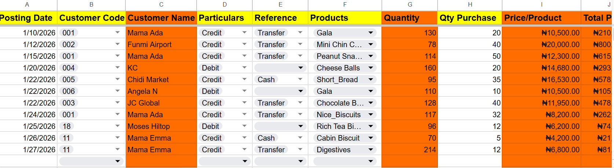
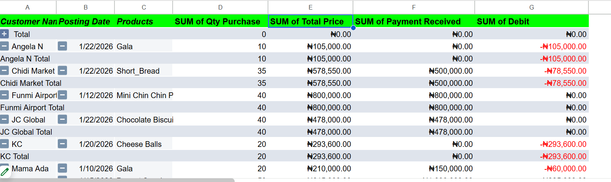

# Google-Sales-Automation
Automated sales records system built in Google Sheets with inventory, admin audit, and summary dashboards.

This project is a mockup automated sales records system designed and maintained in **Google Sheets**.  
It demonstrates how spreadsheets can be used for automation, inventory management, and business insights.

## 📊 Features
- Designed and maintained automated sales records system using 4 interconnected sheets:
  - **Inventory** – Tracks stock levels in real time
  - **Sales Records** – Logs transactions and updates inventory
  - **Admin Audit** – Validates and edits sales entries for accuracy
  - **Summary** – Provides dashboards, pivot tables.
- Implemented formulas, functions, and Google Apps Script to automate data flow and minimize manual entry errors.
- Created dynamic inventory tracking linked to sales data.
- Built summary reports and interactive pivot tables for quick business insights.
- Streamlined sales data management, improving reporting speed and accuracy.

## 🛠 Tools Used
- Google Sheets advanced formulas & functions  
- Google Apps Script (JavaScript automation)  
- Data Validation for error checking  
- Inventory management techniques  
- Pivot tables for summarization  

---

## 🔗 Live Demo
- [View Published Google Sheet (Read-Only)](https://docs.google.com/spreadsheets/d/e/2PACX-1vR5_RKLXSDvboiMGnFZKRr7fd7wP1vBFy1U-3aLvxk8W4qpeLvHycfQatbfzJbviUMmci1nI_5OqUpe/pubhtml)

---

## 📸 Screenshots

## 📫 Contact
- **GitHub:** [Victor123-PC](https://github.com/Victor123-PC)
- **LinkedIn:** [Your LinkedIn Profile](www.linkedin.com/in/v-i-c)
- **Email:** osonobuvictor1994@gmail.com
